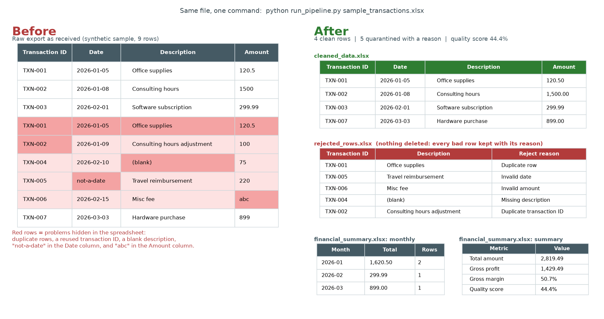

# Turn messy finance spreadsheets into clean, audit-ready reports, automatically

**Stop fixing the same Excel errors every month.** This Python pipeline takes raw transaction files (Excel or CSV), finds and quarantines bad data, and produces clean data, a financial summary, and a data-quality report with one command.



## What it does for your business

- **Catches errors before they reach your reports.** Missing required values, duplicate transactions, invalid dates, and bad amounts are flagged automatically.
- **Never silently deletes data.** Every rejected row is kept in a separate file with the reason it was rejected, so nothing gets lost.
- **Produces ready-to-use reports.** Cleaned data, a financial summary with monthly totals, and a quality score, all exported to Excel.
- **Keeps an audit trail.** Every run is logged with its row counts, rejects, and quality score, and every rejected row carries its reason, so you can show exactly what changed and why.

## Typical use cases

- Cleaning bank, QuickBooks, or accounting exports before month-end close
- Replacing a manual, copy-paste Excel reporting routine
- Checking data quality before importing into another system
- Producing consistent monthly summaries that anyone can rerun

> Need this set up for your own data? See **Work with me** at the bottom.

---

## Technical overview: Financial Data Automation & Data Quality Pipeline

A reproducible Python pipeline for validating, cleaning, analyzing, and reporting financial datasets with deterministic data-quality controls and append-only audit evidence.

## Problem

Manual Excel/CSV finance workflows often accumulate:

- missing values
- inconsistent column names and schemas
- duplicate records
- invalid dates or amounts
- repetitive, hard-to-audit reporting

This repository automates a small, transparent path from raw files to cleaned outputs, metrics, and evidence.

## Architecture

```text
Raw Data
   ↓
Ingestion
   ↓
Validation
   ↓
Data Quality
   ↓
Cleaning
   ↓
Financial Analytics
   ↓
Reporting
   ↓
Verification
   ↓
Audit Evidence
```

## Features

- CSV and XLSX ingestion with column-name normalization
- Required-schema validation (`transaction_id`, `date`, `description`, `amount`)
- Deterministic data-quality checks
- Cleaning that quarantines bad rows instead of silently dropping them
- Financial summary metrics and optional monthly totals
- Excel/CSV reporting under `data/processed/`
- Simple quality score: `clean_rows / input_rows` (documented formula; not a weighted model score)
- Append-only JSONL audit evidence in `evidence/audit.jsonl` (`duplicates_removed` counts exact-row and duplicate-id rejects)
- pytest coverage for core behaviors

## Quick start (Windows PowerShell)

```powershell
cd financial-data-automation
py -3.12 -m venv .venv
.\.venv\Scripts\Activate.ps1
python -m pip install -r requirements.txt
python scripts\generate_sample_data.py
python -m pytest
python run_pipeline.py data/sample/sample_transactions.xlsx
```

### Expected outputs

After a successful demo run:

```text
data/processed/cleaned_data.xlsx
data/processed/rejected_rows.xlsx
data/processed/financial_summary.xlsx
data/processed/quality_report.csv
evidence/audit.jsonl
```

## Design principles

```text
Deterministic
Auditable
Reproducible
Minimal dependencies
Separation of validation and cleaning
No silent data loss
```

Validation reports problems. Cleaning decides what to quarantine and records a `reject_reason` for every rejected row.

## Quality score

```text
quality_score = clean_rows / input_rows
```

If `input_rows` is 0, the score is `0.0`.

## Portfolio relevance

This project demonstrates practical skills for:

- financial data automation
- data quality and validation
- analytics and reporting
- lightweight data governance / audit evidence
- technology risk-friendly reproducibility

It is intentionally small. It is not a claim of enterprise production certification.

## Project layout

```text
src/financial_data_automation/   package code
tests/                           pytest suite
data/sample/                     synthetic demo inputs
data/processed/                  generated reports
evidence/                        append-only audit JSONL
docs/architecture.md             design boundaries
```

## README image (dev only)

`docs/before-after.png` is generated from a real pipeline run on the synthetic sample data. To regenerate it (matplotlib is a dev-only dependency, not needed to run the pipeline):

```powershell
python -m pip install matplotlib
python scripts\generate_sample_data.py
python scripts\make_readme_image.py
```

The script runs the pipeline into a temporary folder, so it does not touch `data/processed/` or `evidence/audit.jsonl`.

## License / data note

Sample data is synthetic. Do not place real customer or account data in this repository.

## Work with me

I build custom versions of this pipeline for small businesses and finance teams: cleaning your exports, automating your monthly reports, and adding reconciliation checks and dashboards.

- Portfolio: https://kozphy.github.io
- Upwork: [add your Upwork profile link here]
